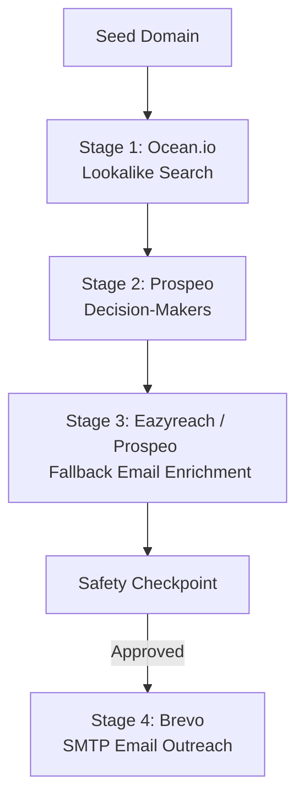

# Automated Cold Outreach Pipeline

A high-performance, decoupled, and self-healing 4-stage B2B outreach pipeline written in Python. It automatically finds lookalike target companies, retrieves decision-makers, enriches corporate email addresses with built-in fallbacks, and executes personalized email campaigns via Brevo.

---

##  Pipeline Architecture

The pipeline consists of four distinct stages structured for credit conservation, resilience, and compliance:



### 1. Stage 1 — Ocean.io (`stages/ocean.py`)
Discovers lookalike companies matching a seed domain's ICP. 
*   **Credit Preservation:** Executes an initial `size=1` probe call to verify API credentials and check match volume before committing credits to a full fetch.
*   **Cost Efficiency:** Pulls up to 10 matching domains (costs 0.2 credits/company).

### 2. Stage 2 — Prospeo (`stages/prospeo.py`)
Queries Prospeo's `search-person` API to find decision-makers at target companies.
*   **Seniority Filter:** Restricts matches directly via payload filters to Founder, C-suite, Partner, VP, Head, and Director-level titles.
*   **Polite Batching:** Incorporates standard spacing delays and handles `400 NO_RESULTS` or `429 Rate Limit` responses gracefully.
*   **Stateful Deduplication:** Maintains a set of processed LinkedIn URLs to prevent adding duplicate contacts across overlapping company queries.

### 3. Stage 3 — Eazyreach / Prospeo Fallback (`stages/eazyreach.py`)
Resolves work emails using LinkedIn profile URLs.
*   **Resilient Fallback:** If the Eazyreach API key is unconfigured or a request fails, the pipeline automatically falls back to Prospeo's `/enrich-person` endpoint using the unique `person_id` retrieved in Stage 2.
*   **Deterministic Lookup:** Uses unique IDs instead of names to avoid homonym collisions.

### 4. Stage 4 — Brevo (`stages/brevo.py`)
Sends personalized cold outreach emails using transactional SMTP templates.
*   **Failure Isolation:** SMTP calls are wrapped in exception handlers so that a single invalid address or bounce does not abort the entire outreach campaign.
*   **Aesthetic Copy:** Delivers a modern, high-agency copy template designed for high conversion.

---

##  Installation & Setup

1.  **Clone the repository:**
    ```bash
    git clone https://github.com/Umesh-chandra-2006/Subspace.git
    cd Subspace
    ```

2.  **Install dependencies:**
    ```bash
    pip install -r requirements.txt
    ```

3.  **Configure Environment Variables:**
    Create a `.env` file in the root directory:
    ```env
    OCEAN_API_KEY=your_ocean_api_key_here
    PROSPEO_API_KEY=your_prospeo_api_key_here
    BREVO_API_KEY=your_brevo_api_key_here
    YOUR_EMAIL=your_inbox_email_here
    EAZYREACH_API_KEY=your_eazyreach_api_key_here # Optional (falls back to Prospeo if empty)
    ```

---

##  Usage

### Mock Mode (Dry Run)
Test the entire pipeline layout locally without making real API calls or spending credits:
```bash
python main.py stripe.com --mock
```

### Live Mode
Execute the full live sequence with real API requests and credit consumption:
```bash
python main.py stripe.com
```

### Safety Console Checkpoint
When running in LIVE mode, the orchestrator displays a structured table summary of resolved contacts and prompts for manual approval before invoking Brevo:
```text
╭───┬──────────────┬────────────────────┬───────────┬───────────────────────────╮
│ # │ Name         │ Title              │ Company   │ Email                     │
├───┼──────────────┼────────────────────┼───────────┼───────────────────────────┤
│ 1 │ Akhil Joshi  │ Associate Director │ Razorpay  │ akhil.joshi@razorpay.com  │
╰───┴──────────────┴────────────────────┴───────────┴───────────────────────────╯

Proceed and send all emails? [yes/no]:
```

---

## 🛡️ Error Handling & Resiliency Features
1.  **Windows Console Safety:** Standard ASCII indicators (`[OK]`, `[!!]`, `->`) are used across all console logs to prevent unicode encoding crashes (`UnicodeEncodeError` on CP1252/Windows Command Prompt).
2.  **Prospeo NO_RESULTS 400 Graceful Intercept:** Prevents the retry loop from looping on 400 status codes when Prospeo returns a `NO_RESULTS` response code.
3.  **Exponential Backoff:** Retries rate-limited `429` requests using double-interval backoffs (`2.0s` -> `4.0s` -> `8.0s`).
